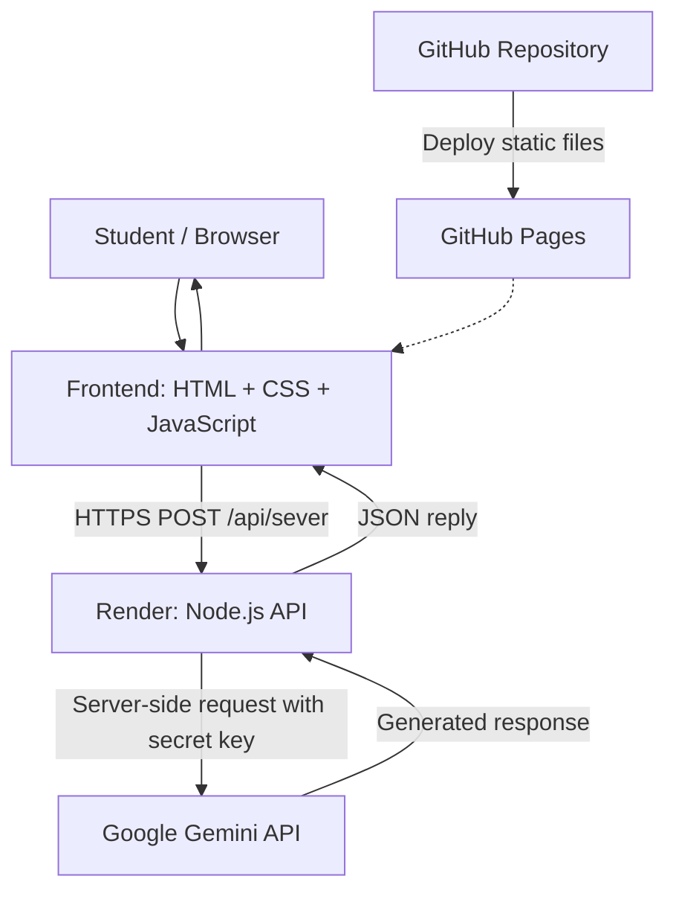

<div align="center">

# 🌱 Chuyện Của Mình

### Technical Documentation · Lá Chắn Xanh AI

**An interactive website and AI-powered chatbot promoting safer digital experiences**

[](https://developer.mozilla.org/en-US/docs/Web)
[](https://nodejs.org/)
[](https://ai.google.dev/)
[](https://pages.github.com/)
**Status:** Prototype / Active Development

</div>

---

## 📖 Overview

**Chuyện Của Mình** is an interactive website featuring **Lá Chắn Xanh AI**, an AI chatbot designed to help students ask questions, share concerns, and explore safer responses to challenging online situations.

This repository documents the **software implementation**: web interface, AI integration, backend API, configuration, deployment, and engineering decisions. It is not a research report, a clinical assessment tool, or a substitute for professional mental-health or emergency support.

## 🧰 Technology Stack & Design Decisions

| Technology | Purpose | Why We Chose It |
|---|---|---|
| **HTML5** | Page structure and chatbot markup | Lightweight, broadly supported, and well suited to static hosting. |
| **CSS3** | Responsive layout, animations, and floating chat interface | Fine-grained visual control without a heavy UI framework. |
| **JavaScript** | User interactions, presentation controls, and API requests | Minimal dependencies, fast iteration, and straightforward deployment for a prototype. |
| **Canva** | Visual presentation and design assets | Helps produce educational visuals quickly and export assets for the website. |
| **Node.js** | Backend HTTP server | Enables JavaScript across the stack and simple integration with external AI APIs. |
| **Google Gemini API** | AI-generated chatbot responses | Supports natural-language conversations and application-specific behavior through prompts. |
| **Git** | Source control | Tracks changes, supports branching, and makes rollbacks possible. |
| **GitHub** | Repository hosting and collaboration | Centralizes code, reviews, and deployment integration. |
| **GitHub Pages** | Static frontend hosting | Publishes HTML, CSS, and JavaScript directly from a repository. |
| **Render** | Node.js backend hosting | Runs server-side code and provides environment-variable configuration. |
| **Custom Domain + DNS** | Public website address | Provides a memorable URL independent of the repository name. |

### Why Not Use a Frontend Framework?

For the current scope, a framework such as React would introduce additional tooling and build complexity. Vanilla JavaScript keeps the website easy to inspect, modify, and deploy. A component framework may become useful if the application grows into a larger multi-page product with complex shared state.

### Why Separate the Frontend and Backend?

**GitHub Pages serves static files; it does not execute a Node.js API server.** Gemini requests also require a secret API key that must not be exposed in browser code.

- **Frontend — GitHub Pages:** Renders the website, collects messages, and displays responses.
- **Backend — Render:** Validates incoming requests, applies server-side configuration, calls Gemini, and returns JSON.
- **Gemini API:** Generates responses according to the application's prompt and safety instructions.

> [!IMPORTANT]
> Never place `GEMINI_API_KEY` in HTML, public JavaScript, `js/config.js`, or a Git commit. Keep it in the backend environment only.

## 🏗️ System Architecture


### Request Lifecycle

1. A user enters a message in the chatbot.
2. Frontend JavaScript sends a `POST` request to the Render API.
3. The backend validates the payload and calls Gemini using server-side configuration.
4. The backend returns a JSON response.
5. The chat interface displays the response or a user-friendly error message.

## 🗂️ Project Structure

The following is a **reference layout** based on the development workflow. Confirm filenames against the actual repository before treating it as an exact inventory.

```text
.
├── index.html              # Website entry point
├── css/
│   └── style.css           # Website and chatbot styles
├── js/
│   ├── config.js           # Public frontend configuration
│   ├── script.js           # UI and chatbot interactions (or split modules)
│   └── slides.js           # Presentation logic, if applicable
├── assets/
│   └── slides/             # Static slide images, if applicable
├── api/
│   ├── server.js           # Node.js HTTP API
│   ├── package.json        # Backend dependencies and scripts
│   └── data/               # Curated reference data, if applicable
└── README.md
```

> [!NOTE]
> Some iterations separate the frontend logic into `presentation.js` and `chat.js`. Use the actual filenames and script references from your current branch.

## 🚀 Local Development

### Prerequisites

- Git
- A supported Node.js LTS release and npm
- A valid Gemini API key

### 1. Clone the Repository

```bash
git clone <YOUR_REPOSITORY_URL>
cd <YOUR_REPOSITORY_NAME>
```

### 2. Install Backend Dependencies

If `package.json` is located inside `api/`:

```bash
cd api
npm install
```

Configure the environment variables required by the backend. For example, use a local `.env` file **only if the server supports loading it**:

```dotenv
GEMINI_API_KEY=your_secret_key
PORT=3000
```

> [!CAUTION]
> Add `.env` to `.gitignore`. The exact variable names and configuration loader must match the implementation in `api/server.js`.

Start the API server:

```bash
node server.js
```

### 3. Start the Frontend

Serve the repository root with a local HTTP server (for example, VS Code Live Server), then open `index.html`.

Point the frontend to the local API during development:

```javascript
const API_URL = 'http://localhost:3000/api/sever';
```

Make sure the backend allows the local frontend origin through CORS. For images hosted on GitHub Pages, use paths such as `./assets/slides/slide-01.jpg` instead of the ASP.NET-style `~/assets/...` prefix.

## 🔌 API Reference

### `POST /api/sever`

Sends a user message to the chatbot backend.

**Example request**

```http
POST /api/sever HTTP/1.1
Content-Type: application/json
```

```json
{
  "message": "What should I do if an anonymous account keeps harassing me online?"
}
```

**Example response**

```json
{
  "reply": "..."
}
```

Some backend versions may also accept conversation history using `history` or a similar property. Check `api/server.js` for the authoritative request schema.

### CORS and Preflight Requests

Because the frontend and backend use **different origins**, browsers may send an `OPTIONS` preflight request before `POST`.

The backend must return a successful preflight response (commonly `204 No Content`) with appropriate headers, for example:

```http
Access-Control-Allow-Origin: https://chuyencuaminh.io.vn
Access-Control-Allow-Methods: POST, OPTIONS
Access-Control-Allow-Headers: Content-Type
```

An `OPTIONS 403 Forbidden` response prevents the browser from sending the intended `POST` request. Handle preflight requests before route authentication or other logic that might reject them.

## ☁️ Deployment

### Frontend — GitHub Pages

1. Push the frontend files to the GitHub repository.
2. Navigate to **Settings → Pages**.
3. Select the deployment source used by the repository (branch/root or GitHub Actions).
4. Configure the custom domain: `chuyencuaminh.io.vn`.
5. Set up the required DNS records and enable HTTPS when domain verification is complete.

**Production API base URL:**

```text
https://chatbotcanva1.onrender.com
```

**Chat endpoint:**

```text
https://chatbotcanva1.onrender.com/api/sever
```

### Backend — Render

If the Node.js application lives inside `api/`, use the following settings:

| Render Setting | Value |
|---|---|
| Service Type | Web Service |
| Root Directory | `api` |
| Build Command | `npm install` |
| Start Command | `node server.js` |
| Environment Variables | `GEMINI_API_KEY` and any additional variables used by the server |

The server should listen on `process.env.PORT` and bind to the appropriate network interface for Render. After deployment, review the service logs and test the endpoint before testing the browser chatbot.

### Why GitHub Pages + Render?

This combination separates a low-maintenance static frontend from a backend that needs runtime execution and protected secrets. It is practical for an early-stage prototype, although it introduces cross-origin requests, separate deployment pipelines, and the need to monitor both services.

## 🔐 Security, Privacy & AI Safety

- **Secrets:** Store API keys in Render environment variables, never in Git history.
- **CORS:** Allow only approved frontend origins.
- **Input validation:** Validate message types and limit message/history size.
- **Error handling:** Never expose secrets, stack traces, or internal configuration to the browser.
- **Rate limiting:** Add request throttling to reduce abuse and unexpected API costs.
- **Data minimization:** Avoid collecting or logging unnecessary personal information, especially from minors.
- **AI safety:** Treat chatbot output as general support, not professional psychological advice or emergency intervention.

> [!WARNING]
> Do not claim that human moderation, anonymous storage, automatic crisis escalation, or dual-layer safety screening is fully implemented until the source code and operational procedures have been verified.

## 🧪 Testing & Troubleshooting

| Symptom | Possible Cause | Recommended Check |
|---|---|---|
| `Failed to fetch` | API unavailable, CORS issue, or network error | Browser DevTools, Render logs, API URL |
| `OPTIONS 403 Forbidden` | Rejected preflight request | CORS handling, middleware order, proxy restrictions |
| `404` on slide images | Incorrect paths or missing deployed assets | Relative paths, filename casing, Pages publish directory |
| Gemini `400` response | Unsupported model or invalid payload | Model identifier and request format |
| Render startup failure | Incorrect root directory, start command, or port | Render settings, `package.json`, `process.env.PORT` |
| API key committed to Git | Exposed secret | Revoke/rotate the key and clean repository history |

### Manual Smoke-Test Checklist

- [ ] The website loads over HTTPS.
- [ ] Images, fonts, and styles load correctly.
- [ ] The chat widget opens, closes, and accepts input.
- [ ] The `OPTIONS` preflight request succeeds.
- [ ] `POST /api/sever` returns valid JSON.
- [ ] Errors are displayed in a user-friendly way.
- [ ] API secrets are absent from browser source and client-side requests.

## 🧭 Engineering Roadmap

- [ ] Add automated frontend and backend tests.
- [ ] Implement API rate limiting and stronger payload validation.
- [ ] Introduce structured logs without storing sensitive conversations.
- [ ] Add health checks, uptime monitoring, and deployment alerts.
- [ ] Improve accessibility, keyboard navigation, and mobile usability.
- [ ] Document and validate safety escalation procedures before broader production use.

## 🤝 Git Workflow & Contributions

Use short-lived feature branches to keep the main branch stable:

```bash
git checkout -b feature/your-feature
# Implement changes and test locally
git add .
git commit -m "feat: describe your change"
git push origin feature/your-feature
```

Open a Pull Request for review before merging into `main`. Prefer consistent commit prefixes such as `feat:`, `fix:`, `docs:`, `refactor:`, and `chore:`.

### Why Git for This Project?

Git makes it possible to trace changes to the chatbot, prompts, website assets, and backend independently. Branches allow experimentation without destabilizing the deployed version, while commits provide a clear record for debugging and reverting regressions.

---

<div align="center">

**Built with care for a safer digital space. 💚**

*Chuyện Của Mình · Lá Chắn Xanh AI · Technical README*

</div>
